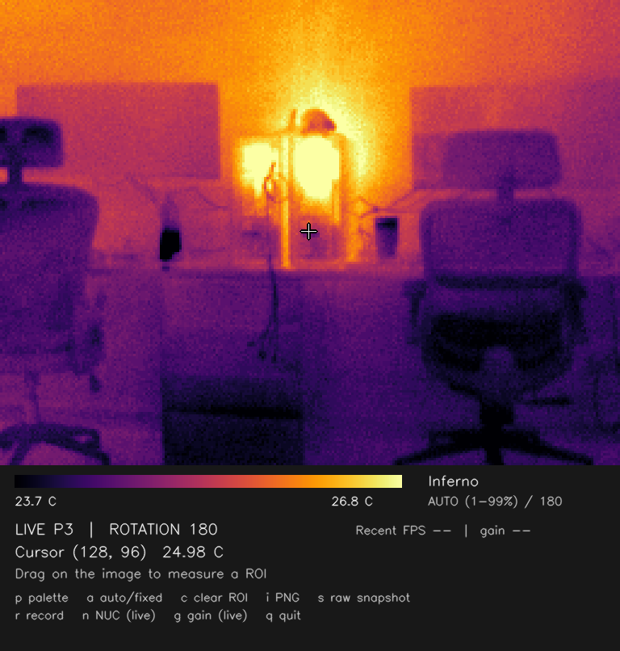
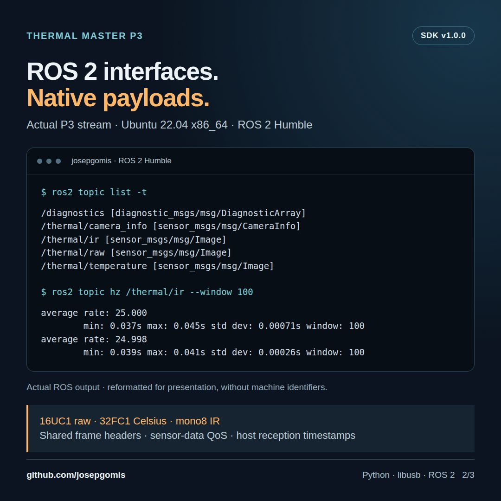
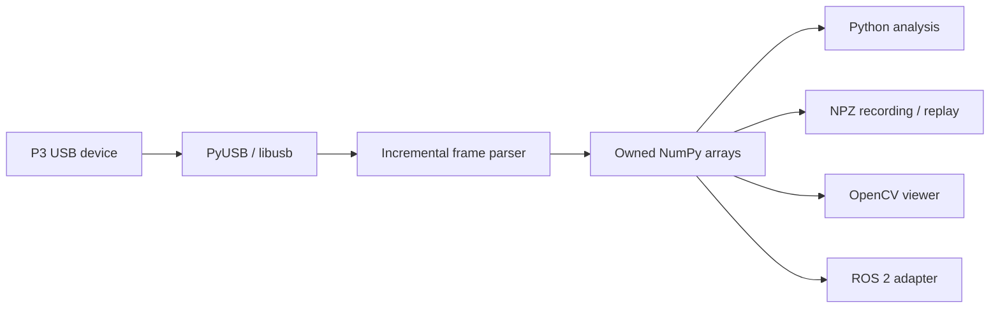

# Unofficial Thermal Master P3 SDK — Python Radiometry and ROS 2

Open-source Python SDK for the **Thermal Master P3 radiometric thermal camera**. Capture native temperature matrices over USB on Linux and Windows, analyze them with NumPy, inspect them in OpenCV, and publish them to ROS 2.

[](https://github.com/josepgomis/unofficial-thermalmaster-p3-sdk/actions/workflows/ci.yml) [](https://github.com/josepgomis/unofficial-thermalmaster-p3-sdk/releases/latest) [](pyproject.toml) [](LICENSE)



*Actual P3 acquisition on Ubuntu 22.04 x86_64, firmware 00.00.02.18. The viewer display is rotated 180° for this mounting; arrays retain their native orientation. [Real-image gallery and provenance](docs/gallery.md).*

**v1.0.0 is the first stable release.** The SDK and ROS 2 Humble adapter passed physical stability and functional validation on Linux x86_64. This is an independent project, not affiliated with or endorsed by Thermal Master.

## Capabilities

- Direct USB access through PyUSB/libusb; no vendor DLL is bundled.
- Native **256 × 192** radiometry, IR brightness and preserved metadata.
- High/low gain and NUC control, explicit timeouts and framing diagnostics.
- Lossless radiometric recording/replay, independent of display palettes.
- Optional OpenCV viewer with cursor/ROI statistics, fixed/automatic scales and exports.
- ROS 2 image topics, CameraInfo, diagnostics, NUC service and automatic reconnect.

| Python data | Shape `[y, x]` | Type / units |
| --- | --- | --- |
| `frame.raw` | `(192, 256)` | `uint16`, 1/64 kelvin |
| `frame.temperature_c` | `(192, 256)` | `float32`, Celsius: `raw / 64 - 273.15` |
| `frame.ir` | `(192, 256)` | `uint8`, infrared brightness |
| `frame.metadata` | `(2, 256)` | `uint16`, original device metadata |

Arrays are owned copies and survive later reads or camera closure. The core is synchronous; the completed-frame queue holds at most two frames. IR is an infrared brightness image, not a visible-light camera. [API and error behavior](docs/api.md).

## Install

Use Python 3.8 or newer and configure [USB access on Linux or Windows](docs/usb.md). Linux requires device permissions; Windows requires WinUSB on the relevant interfaces.

```sh
python -m pip install "git+https://github.com/josepgomis/unofficial-thermalmaster-p3-sdk.git@v1.0.0"
p3 devices
p3 capture frame.npz
```

Git is required for this command. A wheel and source archive are available in the [v1.0.0 release](https://github.com/josepgomis/unofficial-thermalmaster-p3-sdk/releases/tag/v1.0.0). The package is not published on PyPI.

## Read your first temperature matrix

```python
from thermalmaster_p3 import Camera

with Camera() as camera:
    camera.start()
    camera.set_gain("high")
    frame = camera.read_frame(timeout=2.0)
    temperatures = frame.temperature_c
    print("Center pixel (°C):", float(temperatures[96, 128]))
    print("ROI mean (°C):", float(temperatures[80:112, 112:144].mean()))
```

The context manager releases USB resources. Use `Camera(path=...)` or `Camera(serial=...)` when several P3 devices are connected. The numerical conversion does not add emissivity or atmospheric corrections and is not an absolute-accuracy certification.

## Try real data without a camera

Download **p3-real-sample.zip** from the release and extract it into `p3-real-sample/`. It contains 30 actual P3 frames with original arrays and reception timestamps; its manifest excludes device serials.

```sh
p3 replay p3-real-sample
python examples/offline_numpy_analysis.py p3-real-sample
```

The example is included in a checkout of this repository. [NumPy thermal-analysis tutorial](docs/tutorial-numpy.md) explains pixel coordinates, hottest-pixel detection, ROI statistics and saved NPZ files.

To inspect the recording visually:

```sh
python -m pip install "unofficial-thermalmaster-p3[viewer] @ git+https://github.com/josepgomis/unofficial-thermalmaster-p3-sdk.git@v1.0.0"
p3 replay p3-real-sample --viewer --rotate 180
```

## View and record a live stream

```sh
p3 viewer --rotate 180
p3 record sessions/experiment --duration 60
p3 replay sessions/experiment --viewer --rotate 180
```

Use `--rotate 180` only for an inverted mounting. Mouse dragging selects a ROI; `g` changes gain, `n` requests NUC, `r` toggles recording and `i` exports the display. [Viewer controls](docs/viewer.md) · [Recording format](docs/recording.md).


## ROS 2 thermal-camera integration

Follow the [ROS 2 setup and visualization tutorial](docs/tutorial-ros2.md) to install the SDK with the ROS-compatible system Python, build the adapter and launch it:

```sh
ros2 launch thermalmaster_p3_ros p3.launch.py
```

| Default topic | ROS type / encoding | Data |
| --- | --- | --- |
| `/thermal/raw` | `sensor_msgs/Image`, `16UC1` | Native 1/64 K radiometry |
| `/thermal/temperature` | `sensor_msgs/Image`, `32FC1` | Celsius |
| `/thermal/ir` | `sensor_msgs/Image`, `mono8` | IR brightness preview |
| `/thermal/camera_info` | `sensor_msgs/CameraInfo` | Calibration or explicit uncalibrated state |
| `/diagnostics` | `diagnostic_msgs/DiagnosticArray` | Connection, FPS and stream counters |

Images and CameraInfo from each frame share a header. Sensor topics use best-effort, volatile sensor-data QoS. Default topic names can be namespaced or remapped.

In a second terminal with the same ROS environment and `ROS_DOMAIN_ID`:

```sh
ros2 topic list -t
ros2 topic hz /thermal/ir
ros2 run rqt_image_view rqt_image_view /thermal/ir
ros2 service call /thermal/trigger_nuc std_srvs/srv/Trigger '{}'
```



*Actual physical P3 session; command output is reformatted for presentation. Approximately 25 FPS was observed in this session, not guaranteed for every system. [Output provenance](docs/images/ros2-humble-output.json). [Parameters, calibration and rosbag2](docs/ros2.md).*

## Compatibility and validation

| Target | Evidence |
| --- | --- |
| Ubuntu 22.04 x86_64 / ROS 2 Humble | Physical stability, gain/NUC, record/replay, device release and reconnect passed |
| Windows | Earlier physical WinUSB capture/control/reconnect evidence; SDK CI |
| Linux and Windows / Python 3.8, 3.10, 3.12, 3.13 | SDK tests, package build and clean-wheel installation CI |
| ROS 2 Foxy, Humble, Jazzy | Build, adapter tests and simulated-camera rosbag2 record/play CI |
| ARM64 and physical Foxy/Jazzy | Pending hardware validation |

44 SDK tests, 3 ROS adapter tests and all 11 release CI jobs passed. [Measured validation and disclosed stream counters](docs/validation.md).

**Limits:** P3 `3474:45a2` only; absolute thermal accuracy is unverified. SDK timestamps are host reception times, and ROS headers use the host ROS clock after reception. No hardware exposure synchronization, TF extrinsics or fabricated calibration is supplied.

## Architecture



The parser validates start/end framing and resynchronizes after malformed transfers. Commands carry a CRC; image acceptance uses structural framing checks, not a per-image payload CRC. Standalone callers explicitly reopen after disconnect; the ROS node recovers with a fresh stream. [Protocol basis](docs/protocol.md).

## Documentation and contributing

- [Real-image gallery](docs/gallery.md) · [NumPy tutorial](docs/tutorial-numpy.md) · [ROS 2 tutorial](docs/tutorial-ros2.md)
- [API](docs/api.md) · [Examples](docs/examples.md) · [USB setup](docs/usb.md)
- [Viewer](docs/viewer.md) · [Recording](docs/recording.md) · [Validation](docs/validation.md)
- [Guía rápida en español](docs/quickstart-es.md) · [Changelog](CHANGELOG.md)
- [Contributing](CONTRIBUTING.md) · [Release checklist](docs/releasing.md)

Reproducible bug reports and hardware observations are welcome in [Issues](https://github.com/josepgomis/unofficial-thermalmaster-p3-sdk/issues). Useful contributions include ARM64 testing, physical Foxy/Jazzy checks and additional firmware observations. Avoid publishing private serials or identifiable recordings.

For development:

```sh
python -m pip install -e ".[dev]"
python -m pytest -q
python -m build
python -m twine check dist/*
```

## Attribution and license

Apache-2.0. Maintained by [josepgomis](https://github.com/josepgomis). The original implementation is informed by [public P3 protocol research](https://github.com/jvdillon/p3-ir-camera/blob/main/P3_PROTOCOL.md); no upstream driver or vendor binary is bundled. See [NOTICE](NOTICE).

The documented SDK API, CLI, recording format and ROS topic/encoding contracts are stable within 1.x. Breaking changes require a new major version. Private helpers, undocumented metadata fields and diagnostic counter semantics are outside that contract.
