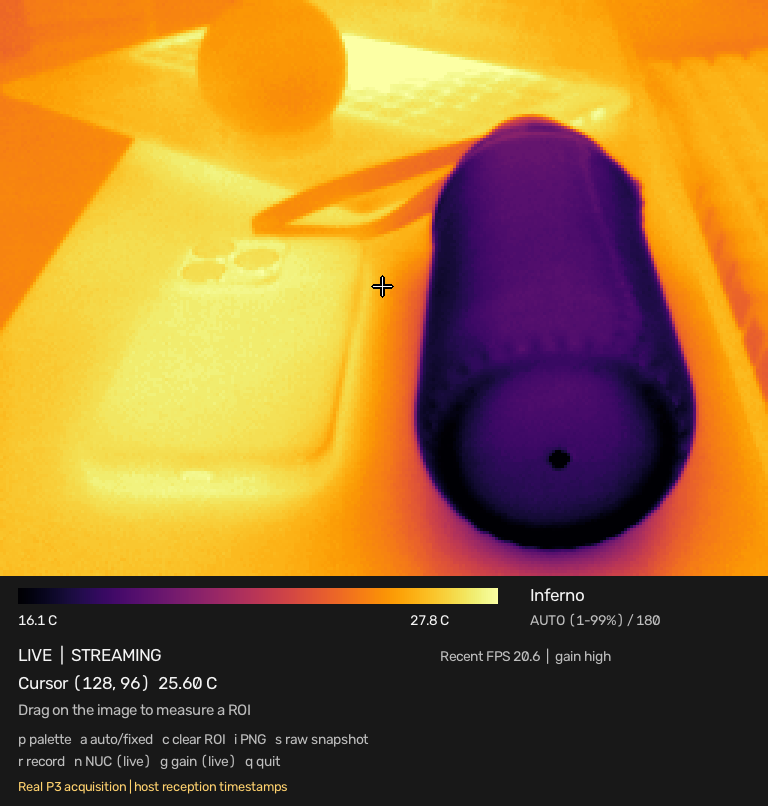
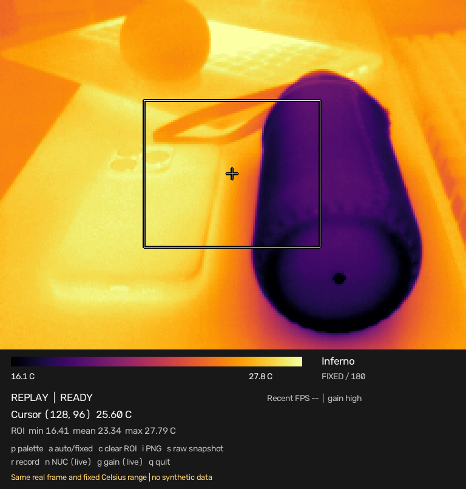

# Unofficial Thermal Master P3 SDK

Independent Python SDK for native radiometric P3 data, with an optional OpenCV viewer and ROS 2 integration. Not affiliated with or endorsed by Thermal Master.

[](https://github.com/josepgomis/unofficial-thermalmaster-p3-sdk/actions/workflows/ci.yml)
[](pyproject.toml)
[](LICENSE)
[](CHANGELOG.md)



*Actual P3 acquisition on Windows, firmware 00.00.02.18, display rotated 180 degrees for this mounting. The image above is exported by the same compositor used in the viewer; no synthetic thermal data. [Image provenance](docs/images/provenance.json).*

**0.1.0 is an alpha.** Windows USB access and real radiometric capture have been exercised. Linux hardware and absolute measurement accuracy remain unverified. Check the [validation report](docs/validation.md) for measured results and the distinction between hardware tests and automated tests.

## Install and capture

Install from GitHub (Python 3.8 or newer; Git required):

```sh
python -m pip install "git+https://github.com/josepgomis/unofficial-thermalmaster-p3-sdk.git@v0.1.0"
p3 devices
p3 info
p3 capture frame.npz
```

First configure USB access using the [Windows/Linux guide](docs/usb.md). The SDK never installs or replaces system drivers.

```python
from thermalmaster_p3 import Camera

with Camera() as camera:
    camera.start()
    frame = camera.read_frame(timeout=2.0)
    temperatures = frame.temperature_c  # float32 Celsius, shape (192, 256)
    print(temperatures[96, 128])
```

`frame.raw` retains the original `uint16` radiometric values. `frame.ir` is the camera's gain-mapped infrared brightness image, **not a visible-light camera**. Display processing never modifies radiometric data.

Load the saved matrix without a camera:

```python
import numpy as np

with np.load("frame.npz", allow_pickle=False) as saved:
    temperatures = saved["temperature_c"]
    print(temperatures.shape, temperatures.mean())
```

Wheel, source archive and actual P3 sample are attached to the [0.1.0 alpha release](https://github.com/josepgomis/unofficial-thermalmaster-p3-sdk/releases/tag/v0.1.0). From a checkout, use `python -m pip install .`. PyPI publication is prepared but has not happened; install from GitHub or a release wheel today.

## Viewer and recording

```sh
python -m pip install "unofficial-thermalmaster-p3[viewer] @ git+https://github.com/josepgomis/unofficial-thermalmaster-p3-sdk.git@v0.1.0"
p3 viewer
p3 viewer --range 15 60
p3 record sessions/experiment --duration 60
p3 replay sessions/experiment
p3 replay sessions/experiment --viewer
```

Viewer controls: `q` quit, `p` palette, `a` auto/fixed scale, `c` clear ROI, `i` PNG export, `s` radiometric snapshot, `r` recording, `n` NUC, `g` gain. Drag on the image for ROI statistics. Exports and sessions go into `sessions/`.



*The same real frame in replay, with ROI min/mean/max and a fixed range. Palettes change appearance; temperatures stay unchanged. [Viewer guide and palette comparison](docs/viewer.md).*

Download `p3-real-sample.zip` from the release, extract it, then run `p3 replay p3-real-sample --viewer`. It contains 30 actual P3 frames (about 1.6 MB compressed), original radiometry and a manifest without device serial identifiers. [Recording and sample instructions](docs/recording.md).

## ROS 2 and documentation

- [ROS 2 setup, topics, calibration and rosbag2](docs/ros2.md)
- [Viewer controls, scale and exports](docs/viewer.md)
- [Examples: acquisition, NumPy, recording and ROS](docs/examples.md)
- [Public API and error behavior](docs/api.md)
- [Recording format](docs/recording.md)
- [Protocol basis and limitations](docs/protocol.md)
- [Compatibility and validation status](docs/validation.md)
- [Guía rápida en español](docs/quickstart-es.md)
- [Contributing](CONTRIBUTING.md) and [release checklist](docs/releasing.md)

Examples cover [capture](examples/capture.py), [NumPy analysis](examples/numpy_analysis.py), [OpenCV](examples/opencv_viewer.py), and [record/replay](examples/record_replay.py).

## Development

```sh
python -m pip install -e ".[dev]"
python -m pytest -q
python -m build
python -m twine check dist/*
```

CI passed on Windows/Linux with Python 3.8, 3.10, 3.12 and 3.13. Foxy, Humble and Jazzy jobs passed colcon build/tests and simulated-camera rosbag2 recording/playback. See the [validation report](docs/validation.md) for evidence and the pending physical-camera checks.

## Attribution and license

Original SDK implementation informed by the public [P3 protocol research by jvdillon and contributors](https://github.com/jvdillon/p3-ir-camera/blob/main/P3_PROTOCOL.md). We did not copy the upstream Python driver. Protocol field values and documented command packets are interoperability facts. See [NOTICE](NOTICE).

Apache-2.0. Product names and trademarks belong to their respective owners. Pre-1.0 API changes will be documented in [CHANGELOG.md](CHANGELOG.md).

Maintained by [josepgomis](https://github.com/josepgomis). Report reproducible problems or share hardware validation through [GitHub Issues](https://github.com/josepgomis/unofficial-thermalmaster-p3-sdk/issues). Contributions to Linux hardware testing and additional P3 firmware observations are welcome.
