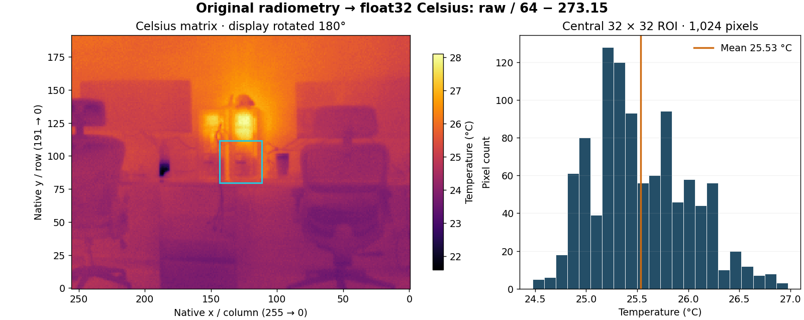
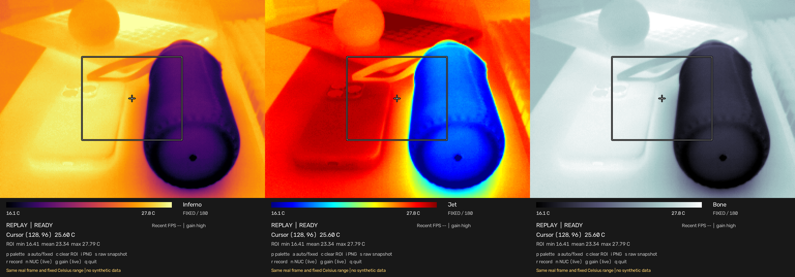

# Real Thermal Master P3 acquisition gallery

Every thermal image here comes from physical P3 measurements. Rendered colors are display mappings of original radiometric arrays. Command-output presentations are labeled separately; they are not literal desktop-terminal screenshots.

## Linux acquisition

One actual Linux SDK acquisition, firmware 00.00.02.18. Display rotation is 180° for this mounting; native matrices remain unchanged. The exported composition shows the SDK viewer rather than a photograph of the device.

## Radiometric matrix with native coordinates

Calculated directly from a real NPZ capture. Axes are native `(x, y)` coordinates. The display uses the same 180° mounting rotation as the viewer; reversed axis labels preserve native coordinates. Stored arrays are unchanged. The histogram describes pixels within one ROI; it is not a thermal-accuracy test.

## ROI measurement and palettes

Earlier physical Windows acquisition, displayed in replay. Cursor and ROI values use the radiometric data.

Same recorded frame and scale, three display palettes. These are replay views, not three independent acquisitions. [Original Windows provenance](images/provenance.json).

## ROS 2 Humble

Measured output from a physical P3 session on Linux. Only the public identity `josepgomis` appears in the presentation. [Measured output](images/ros2-humble-output.json).

[Linux/ROS gallery provenance](images/linux-gallery-provenance.json) records source, processing and support limits. [Validation](validation.md) distinguishes physical evidence from simulation and documents stream counters.
